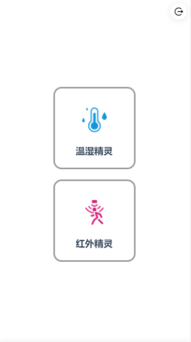
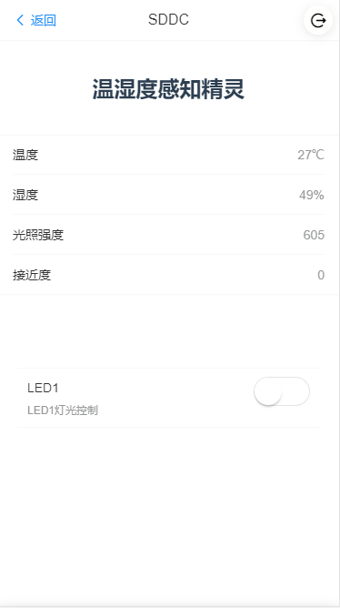
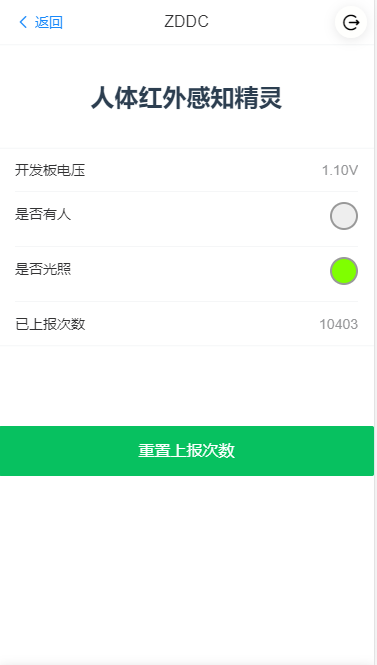

# 智慧精灵
## 概述
这是一款智能家居应用，实现对智慧精灵系列的智能家居模块进行控制及监测。目前控制设备如下：
- 温湿度感知精灵
- 人体灯光感知精灵

# 项目结构
```
|------- backend   // 后端 jsre 项目工程文件
|------- frontend  // 前端 vue 项目工程文件
|------- images    // 项目界面图片
|------- readme.md
```




## 前端构建说明
### 技术架构
- 框架: Vue
- UI: Vant

### 构建方式
    1. cd frontend 
    2. npm install
    3. npm run serve 
    4. npm run build (构建项目)
> npm run build 会直接输出打包文件到 backend/public 目录下

## 后端结构说明
> backend目录是标准的 EdgerOS APP 开发目录

### 环境配置
- 设备
    - Spirit1
    - 人体灯光感知精灵
    - 温湿度感知精灵
- 设备链接
    - [链接设备参考请智能插座实例](https://www.edgeros.com/edgeros/guide/tutorial_adv/device_plug.html)